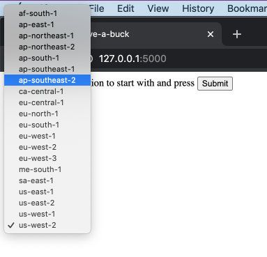
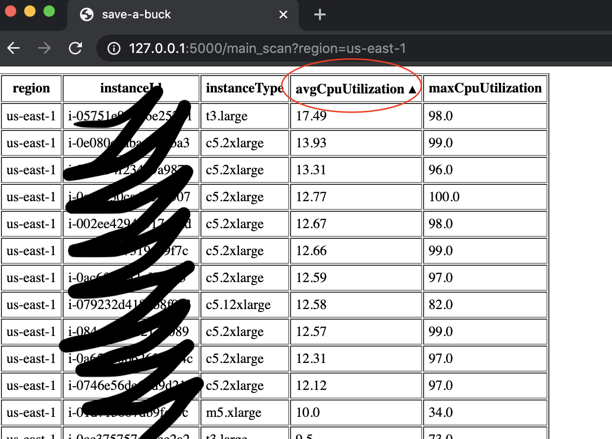
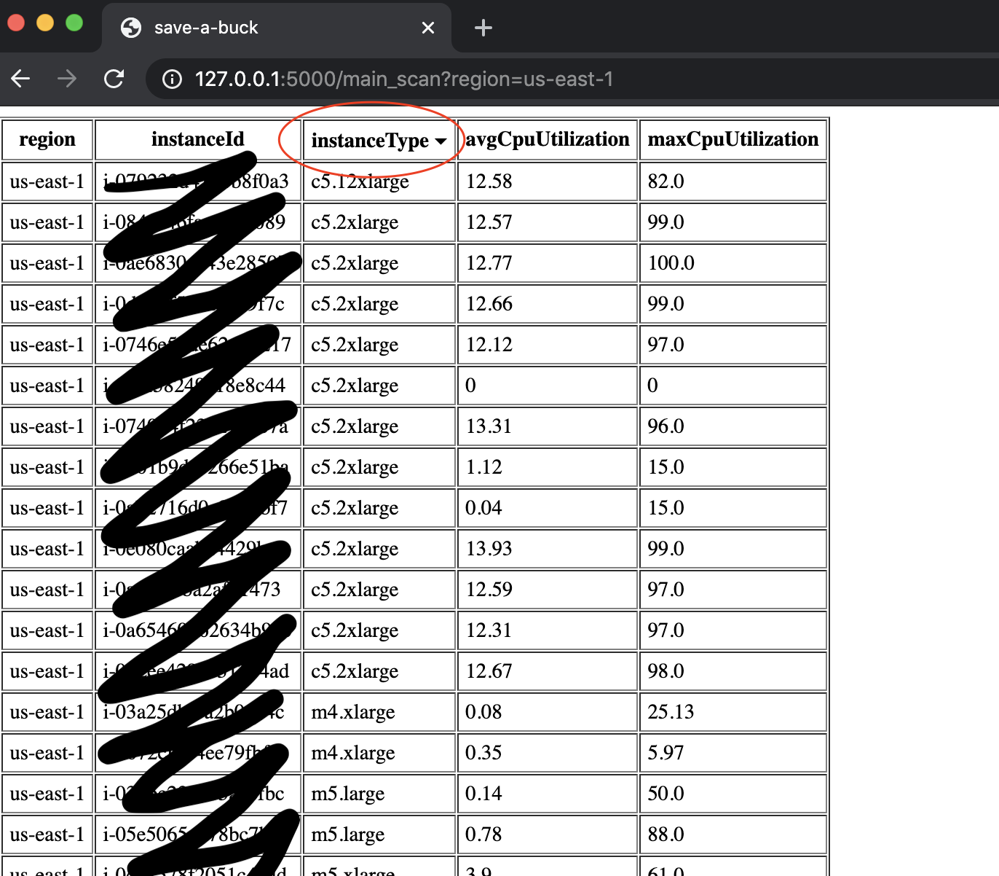

# save-a-buck
Simple script to get the load of resources in AWS

# requirements
Python3, libs: argparse, datetime, json, time, boto3, botocore

# execution
Run `FLASK_APP=hello.py flask run` from the root of the repo
Access application with browser via http://127.0.0.1:5000/

# screenshots

